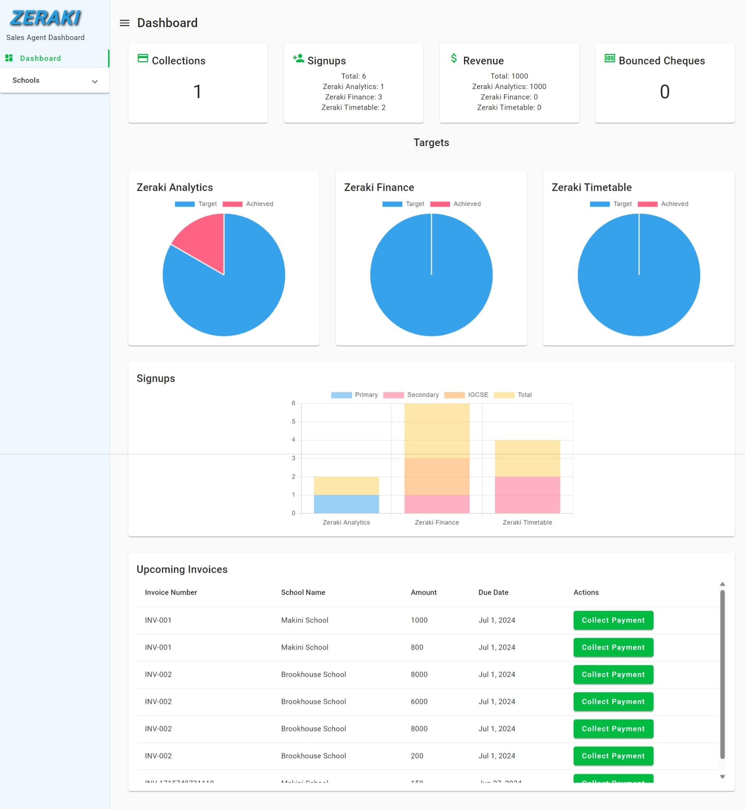
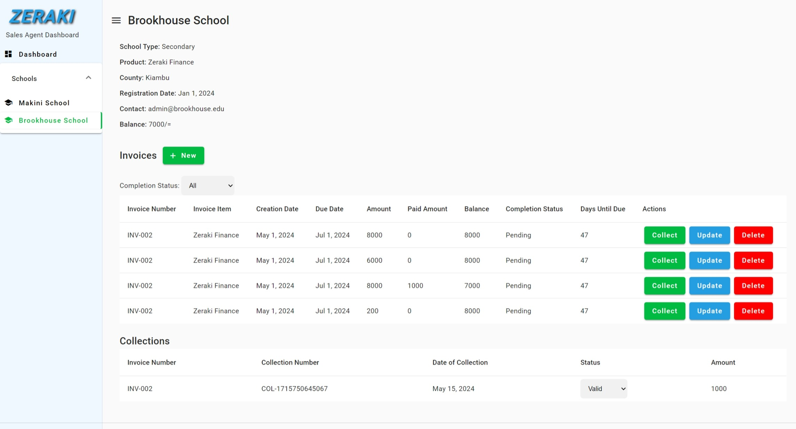
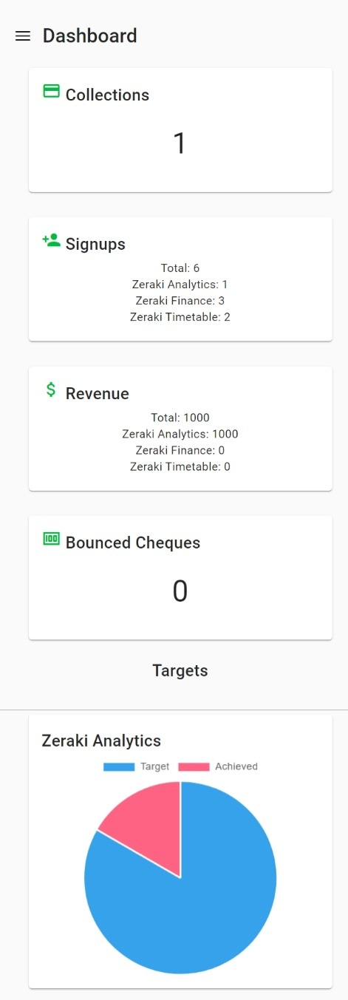

# SalesAgentDashboard

- A responsive sales agent dashboard for an ed-tech platform that facilitates the management of school accounts, invoicing, and collections, including data visualization for targets and sign-ups. 
- Utilizes cutting-edge Angular features such as Standalone Components, Signals and SSR.
- This project was generated with [Angular CLI](https://github.com/angular/angular-cli) version 17.3.7.

## Features

- A responsive dashboard with a sidebar and a main content area.
- Panels/Cards for visualizations of the number of cheques, amount of revenue, etc.
- Various charts such as bar, line, and pie charts for visualizing signups, targets, etc.
- A list of schools with their details.
- A list of invoices with their details along with CRUD and filtering capabilities.
- A list of collections with their details.

## Screenshots

- Dashboard
  

- Schools
  

- Dashboard (Mobile)
  

## Technologies Used

- Angular 17
- Angular Material
- Jest
- JSON Server
- ng2-charts

## Project Structure

- `src/app/components` contains the sidenav with buttons to navigate to the dashboard and all schools, and the router-outlet for the dashboard and schools components.
- `src/app/dashboard` - Contains the dashboard component routed at `/dashboard`, the dashboard service, and test files.
- `src/app/schools` - Contains the schools component routed at `/schools/:id`, the schools service, and test files.
- `src/app/shared` - Contains the shared components such as forms.
- `src/app/shared/models` - Contains the models for schools, invoices, and collections.

## Key Design Decisions

- All components are standalone making them loosely coupled and easier to reuse.
- Angular material is used for the UI components to maintain a consistent look and feel.
- Angular material's breakpoint observer is used to make the sidenav and dashboard cards responsive to different screen sizes.

## Prerequisites

- Node.js
- Angular CLI

## Setup and Usage

- First you need to install the dependencies by running `npm install`.
- Then mock the backend by running `npx json-server --watch db.json` in a separate terminal.
- Finally, run `ng serve` for a dev server. Navigate to `http://localhost:4200/`. The app will automatically reload if you change any of the source files.

## Testing

Unit tests have been set up for services with the help of Jest which has builtin support for Angular 17. Run `ng test` to execute the unit tests.

## Live Demo

Coming soon!
